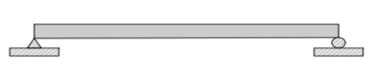
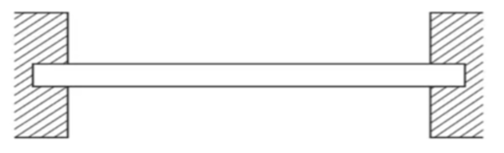
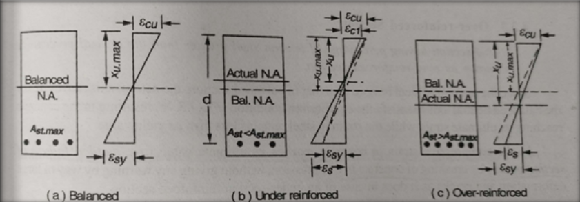

## Introduction to Beams:

In any type of structure, the basic structural elements are beams, columns, slabs, footings, etc. They are subjected to bending, transverse shear, torsion and axial tension or compression. According to the beam theory, a beam is a structure which has one of its dimensions much larger than the other two. They are usually made up of straight prismatic members that span in between supports that may be of any form. Beams are usually horizontal structural elements that carry loads perpendicular to their longitudinal direction. Each beam structural element is defined by its geometric and material properties. In case of design of beam element, there is more flexibility in choosing the size and type of materials that work best for the structure. The section and material properties are practically selected based on their cost, size and fire rating. Loads on a beam induce internal compression, tensile and shear stresses. Typically under gravity loads, the beam bends into a slightly circular arc, with its original length compressed at the top ( Compression) and correspondingly stretched at the bottom (Tension) is known as Sagging while a configuration with Tension at the top fibers and Compression at the bottom fibers is known as Hogging.

## In engineering, beams are of several types :

### Simply supported beam :
A simply supported beam is one that rests on two supports and is free to move horizontally. Typical practical applications of simply supported beams include bridges, beams in buildings, etc.

### Cantilever beam :
A cantilever beam is a structural element that extends horizontally and is supported on only one end. The unsupported end is known as the cantilever, and it extends beyond the support point. Cantilever beams are often used in construction to support balconies, roofs, and other overhangs.

### Fixed Beam :
A fixed beam is one that is fixed on both ends of the beam with supports. This type of beam does not allow for bending moment production and will not have any vertical movement or rotation. Fixed beams are most frequently used in trusses and similar structures.

### Continuous Beam :
A continuous beam, i.e. a beam that has more than two supports, is statically indeterminate. The reactions in the supports of a continuous beam cannot be obtained with the equations of static equilibrium only.

### Overhanging beam :
When the end of a beam extends beyond the support, it is referred to as an overhanging beam. Overhanging can occur on one or both sides of the supports.

#### Type Of Sections :
##### Balanced Section or Critical Section:
- Strain in steel and Strain in concrete reach their maximum values simultaneously.

##### Under-Reinforced Section:
- A section having steel percentage less than the critical percentage is known as under reinforced section.
- Compressive Strain in steel reaches its ultimate value first.
- It gives sufficient warning of impending failure.

##### Over Reinforced Section:
- Compressive Strain in concrete reaches its ultimate value first.
- Sudden Failure of Section occurs by crushing of concrete in compression.
 

#### Preference for Under-Reinforced Section :
- Under-reinforced sections are often preferred because they exhibit ductile behaviour, allowing for warning signs before failure.
- The gradual yielding of steel provides a more forgiving and predictable response, making it easier to assess and repair structural issues.
- Ductile failure allows for redistribution of loads and prevents sudden, catastrophic collapses.

