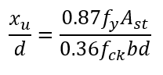
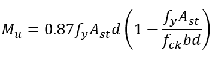

## Theory 

#### Introduction to Beams:

In any type of structure, the basic structural elements are beams, columns, slabs, footings, etc. They are subjected to bending, transverse shear, torsion and axial tension or compression. According to the beam theory, a beam is a structure which has one of its dimensions much larger than the other two. They are usually made up of straight prismatic members that span in between supports that may be of any form. Beams are usually horizontal structural elements that carry loads perpendicular to their longitudinal direction. Each beam structural element is defined by its geometric and material properties. In case of design of beam element, there is more flexibility in choosing the size and type of materials that work best for the structure. The section and material properties are practically selected based on their cost, size and fire rating. Loads on a beam induce internal compression, tensile and shear stresses. Typically under gravity loads, the beam bends into a slightly circular arc, with its original length compressed at the top ( Compression) and correspondingly stretched at the bottom (Tension) is known as Sagging while a configuration with Tension at the top fibers and Compression at the bottom fibers is known as Hogging.

### In engineering, beams are of several types :

#### Simply supported beam :

A simply Supported Beam is one that rests on two supports and is free to move horizontally through on of two supports.

#### Cantilever beam :

A cantilever beam is a structural element that extends horizontally and is supported on only one end. The unsupported end is known as the cantilever, and it extends beyond the support point. Cantilever beams are often used in construction to support balconies, roofs, and other overhangs.

#### Fixed Beam :

A fixed beam is one that is fixed on both ends of the beam with supports. This type of beam produces bending moment at its fixed ends and will not allow any translation (horizontal or vertical movement) or rotation. This type of beam is statically indeterminate.

#### Continuous Beam :

A continuous beam, i.e. a beam that has more than two supports, is statically indeterminate. The reactions in the supports of a continuous beam cannot be obtained with the equations of static equilibrium only.
These types of beams are commonly used in buildings

#### Overhanging beam :

When the end of a beam extends beyond the support, it is referred to as an overhanging beam. Overhanging can occur on one or both sides of the supports.

#### Limit State Design:
The design of beams is carried out using the Limit State Design (LSD) method as per IS 456:2000, which ensures both safety and serviceability. In this method, partial safety factors are applied to both loads and material strengths to account for uncertainties. There are two types of Limit States which are:
1.	Limit State of Collapse: The limit state of collapse ensures that the structure has sufficient strength to prevent failure under maximum (factored) loads. It is concerned with safety against collapse due to bending (flexure), shear, torsion and axial forces.
2.	Limit State of Serviceability: The limit state of serviceability ensures that the structure remains functional throughout its intended lifespan. It checks for deflection, cracking of concrete and durability issues such as corrosion.

 

### Type Of Sections :

#### Balanced Section:

- Both concrete in compression and steel in tension reach their permissible stress limits simultaneously.
- Balanced section is used to determine the limiting moment of resistance of a section.

#### Under-Reinforced Section:

- A section having steel percentage less than the critical percentage is known as under reinforced section.
- Tensile strain in steel reaches its yielding limit first
- It gives sufficient warning of impending failure.

#### Over Reinforced Section:

- Compressive Strain in concrete reaches its ultimate value first.
- Sudden Failure of Section occurs by crushing of concrete in compression.

 

#### Preference for Under-Reinforced Section :

- Under-reinforced sections are often preferred because they exhibit ductile behaviour, allowing for warning signs before failure.
- The gradual yielding of steel provides a more forgiving and predictable response, making it easier to assess and repair structural issues.
- Ductile failure allows for redistribution of loads and prevents sudden, catastrophic collapses.

#### Neutral axis and depth determination:

Neutral axis (N. A.) in a reinforced concrete beam is the beam’s cross-section where there is no longitudinal stress or strain due to bending. It can also be considered as a dividing line between the tension and compression zones. The N. A. depth can be determined as:

 
 
#### Area of steel:
Area of steel can be determined as:
 
 
